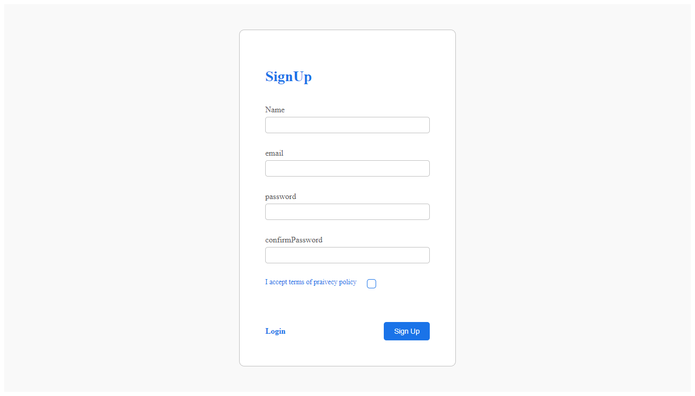

# Getting Started with Create React App

This project was bootstrapped with [Create React App](https://github.com/facebook/create-react-app).
## image website registration-google
;
Project Title: Google Registration Form with React

# Description:

Embark on the journey of seamless user registration with the Google Registration Form, a React-based single-page application (SPA) that provides a user-friendly experience for signing up. This project incorporates form validation to ensure data integrity and offers clear feedback messages for both errors and successful registrations.

# Key Features:

Single-Page Application (SPA): The registration form is implemented as a single-page application, minimizing page reloads and providing a smooth user experience.

Form Validation: Comprehensive form validation ensures that all required fields are filled out correctly. Users will be presented with clear error messages if any information is missing or invalid.

Real-Time Feedback: The form provides real-time feedback on user input, dynamically updating error messages as users interact with the registration fields.

Success Confirmation: Upon successful submission of the registration form, users receive a success message, confirming their registration and providing a positive interaction.

Responsive Design: The application is designed to be responsive, offering a consistent and visually appealing experience across various devices.

Interactive UI Elements: Interactive UI elements, such as form buttons and input fields, enhance the overall user experience and make the registration process more engaging.

State Management: Leveraging React state management, the application efficiently manages user input and updates the UI dynamically.

Technologies Used:

React.js
Single Page Application (SPA) architecture
Responsive design principles
How to Run:

Clone the repository from [GitHub Repo Link].
Navigate to the project directory.
Run npm install to install dependencies.
Run npm start to start the development server.
Open the application in your browser at http://localhost:3000.
Note:

This project serves as a frontend demonstration and requires integration with a backend authentication system for a complete registration process.

Feel free to explore the code, customize the form fields, and use it as a foundation for creating secure and user-friendly registration forms in your applications.

Happy registering!